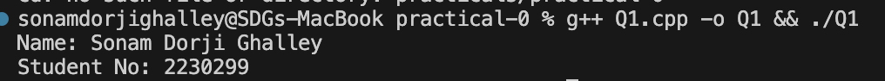
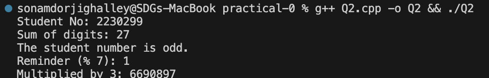
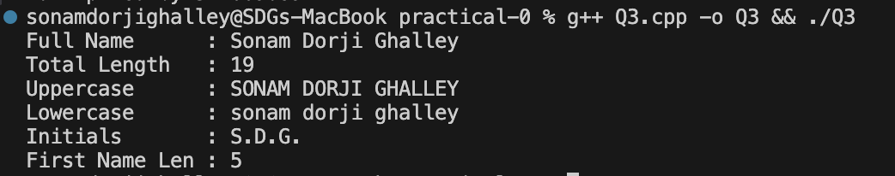
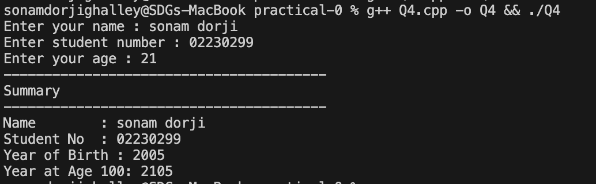
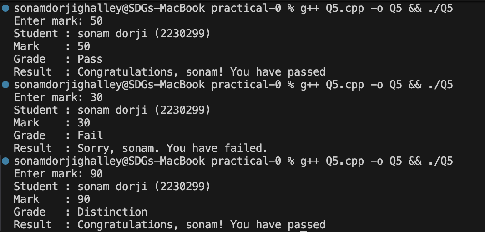
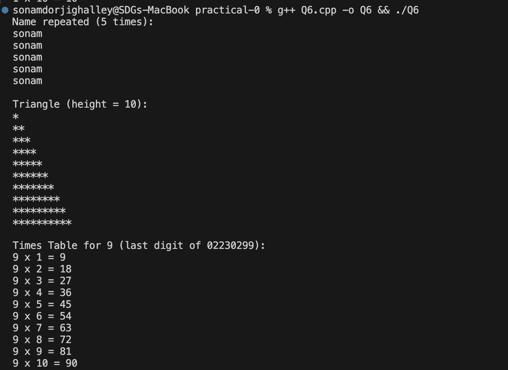
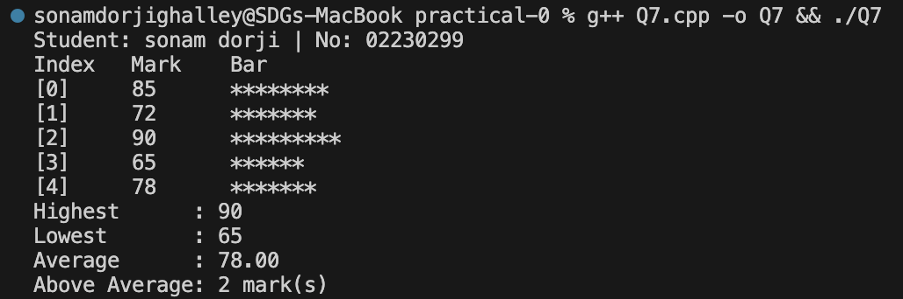
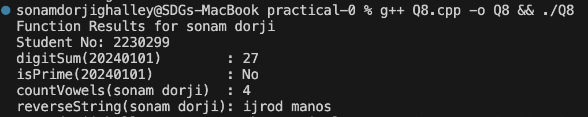
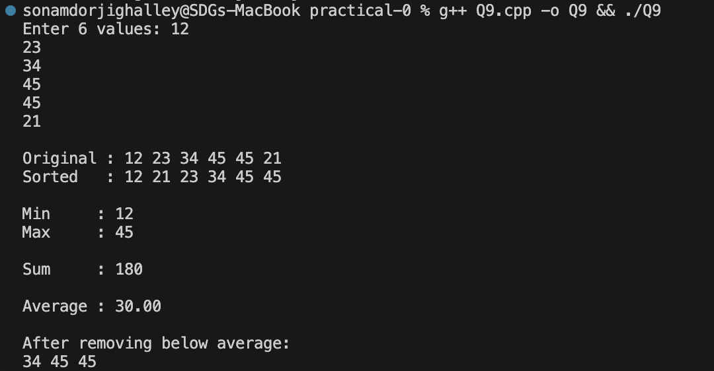
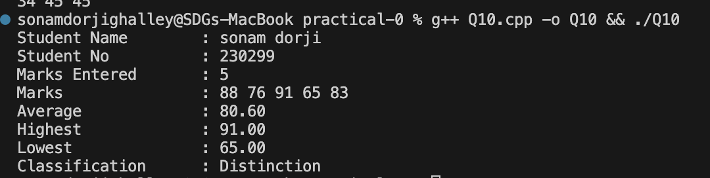

# CSF303 - Practical Work

## Practical 0: C++ Fundamentals

This practical exercise covers fundamental C++ programming concepts including variables, string manipulation, loops, arrays, vectors, and object-oriented programming.

---

## Q1: Student Information Display

**Description:**  
A simple program that displays student information (name and student number).

**Key Concepts:**

- String variables
- Basic input/output with `cout`

**Code Snippet:**

```cpp
string fullName = "Sonam Dorji Ghalley";
int studentNumber = 2230299;

cout << "Name: " << fullName << endl;
cout << "Student No: " << studentNumber << endl;
```

**Output:**



## Q2: Sum of Digits & Even/Odd Check 

**Description:**  
Calculating the sum of all digits in the student number and determining if the number is even or odd.

**Key Concepts:**

- While loops
- Modulo operator (%)
- Integer division
- Conditional statements

**Code Snippet:**

```cpp
int SUM = 0;
while (studentNumber > 0) {
    SUM += studentNumber % 10;  // Extract last digit
    studentNumber /= 10;        // Remove last digit
}
```

**Output:**



---

## Q3: String Manipulation

**Description:**  
Performs various string operations including converting to uppercase/lowercase, counting characters, and removing spaces.

**Key Concepts:**

- String length
- `transform()` function with `::toupper` and `::tolower`
- String iteration
- Character filtering

**Code Snippet:**

```cpp
string upper = fullName;
transform(upper.begin(), upper.end(), upper.begin(), ::toupper);

string lower = fullName;
transform(lower.begin(), lower.end(), lower.begin(), ::tolower);
```

**Output:**



## Q4: User Information & Year of Birth Calculation

**Description:**  
Taking user input (name, student number, age) and calculating the year of birth and displaying the formatted information.

**Key Concepts:**

- User input with `cin` and `getline()`
- Data types (string, int)
- Arithmetic operations
- Formatted output with `setw()` and `setfill()`

**Code Snippet:**

```cpp
cout << "Enter your name : ";
getline(cin, name);

int yearOfBirth = currentYear - age;
```

**Output:**



## Q5: Grade Assignment & PASS/FAIL Result

**Description:**  
Taking a student's mark as input and assigns a grade (A, B, C, D, F) based on the mark. Displays PASS/FAIL result.

**Key Concepts:**

- Input validation
- Multiple conditional statements (if-else)
- Grade assignment logic

**Code Snippet:**

```cpp
if (mark < 0 || mark > 100) {
    cout << "Error: Mark must be between 0 and 100." << endl;
    return 1;
}
```

**Output:**



---

## Q6: String Repetition & Pattern Generation

**Description:**  
Using string length to repeat the name a certain number of times and generates a right-angled triangle pattern based on character count.

**Key Concepts:**

- For loops
- String iteration
- Nested loops for pattern generation
- Space and special character manipulation

**Code Snippet:**

```cpp
int firstNameLen = firstName.length();
for (int i = 0; i < firstNameLen; i++) {
    cout << firstName << endl;
}
```

**Output:**



---

## Q7: Array Statistics & Analysis

**Description:**  
Analyzes an array of 5 marks, calculating highest, lowest, average, and variance.

**Key Concepts:**

- Arrays
- Loop iteration
- Statistical calculations
- `setw()` and `fixed` for formatted output

**Code Snippet:**

```cpp
int sonam_marks[5] = {85, 72, 90, 65, 78};
int highest = sonam_marks[0];
int lowest = sonam_marks[0];
```

**Output:**



---

## Q8: Prime Numbers & Digit Sum Analysis

**Description:**  
Finding all prime numbers in a given range and calculating their digit sums, and performing analysis on prime properties.

**Key Concepts:**

- Functions (`digitSum()`, `isPrime()`)
- Prime number checking algorithm
- Digit manipulation

**Code Snippet:**

```cpp
bool isPrime(int n) {
    if (n < 2) return false;
    for (int i = 2; i * i <= n; i++) {
        if (n % i == 0) return false;
    }
    return true;
}
```

**Output:**



---

## Q9: Vector Operations & Sorting

**Description:**  
Taking 6 user inputs, stores them in a vector and performs operations like sorting, reversing, calculating sum and average.

**Key Concepts:**

- Vectors in C++
- `sort()` function
- `reverse()` function
- `accumulate()` for sum calculation
- Vector iteration

**Code Snippet:**

```cpp
vector<int> v20240101;
for (int i = 0; i < 6; i++) {
    cin >> input;
    v20240101.push_back(input);
}
```

**Output:**



---

## Q10: Student Class & Object-Oriented Programming

**Description:**  
Implements a `Student` class with methods to add marks, display student information, and calculate statistics like average, highest, and lowest marks.

**Key Concepts:**

- Object-oriented programming (OOP)
- Class definition with private/public members
- Constructor
- Methods/member functions
- Vectors within classes
- Encapsulation

**Code Snippet:**

```cpp
class Student {
private:
    string name;
    int studentNumber;
    vector<float> marks;

public:
    Student(string n, int sn) {
        name = n;
        studentNumber = sn;
    }
};
```

**Output:**



---

## Summary

### Learning Outcomes

This practical exercise has significantly enhanced my knowledge and understanding of C++ programming. Through these 10 questions, I have gained comprehensive experience with:

**Core C++ Syntax & Features Mastered:**

- Variable declaration and initialization (`int`, `string`, `float`)
- Input/Output operations with `iostream` library (`cin`, `cout`, `getline()`)
- String manipulation using `<string>` library and STL algorithms
- Control flow statements (if-else, while loops, for loops)
- Functions and function parameters
- Arrays and Vectors for data storage and manipulation
- Object-Oriented Programming (OOP) principles with classes and objects
- Encapsulation with private/public members
- Constructors and member functions
- Proper header includes and namespaces

**Technical Skills Developed:**

- Algorithms for mathematical operations (prime checking, digit sum calculation)
- Statistical analysis (mean, variance, highest/lowest values)
- String processing and pattern generation
- Vector operations (sorting, reversing, accumulation)
- Input validation and error handling
- Data manipulation and formatting with `iomanip` library
- Logical problem-solving and algorithmic thinking

**Programming Practices Learned:**

- Writing clean and readable code with proper variable naming
- Using meaningful comments for code clarity
- Implementing efficient algorithms (e.g., prime checking with optimized loop)
- Code organization and modular design through functions and classes
- Type safety and proper data type selection
- Memory management in C++ with dynamic data structures (vectors)

**Practical Applications:**

- User-interactive programs with input validation
- Real-world data processing (grades, marks, statistics)
- Class-based design for managing complex data structures
- Combining multiple C++ features to solve practical problems

This practical has provided a solid foundation in C++ programming, covering everything from basic syntax to advanced OOP concepts, making me proficient in writing efficient, well-structured C++ programs.
