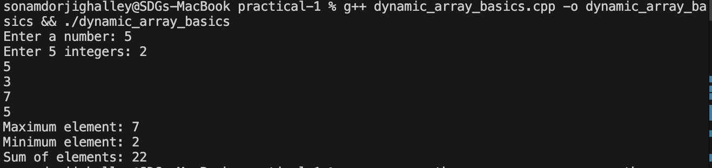
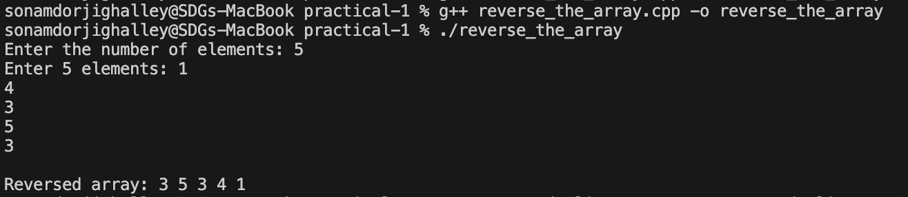
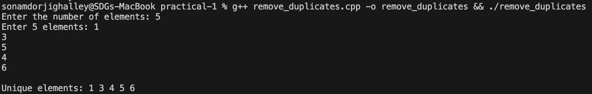
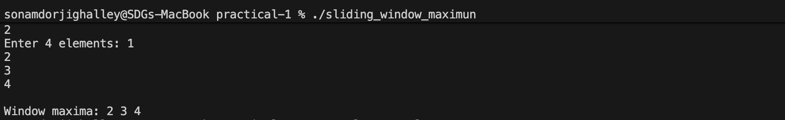
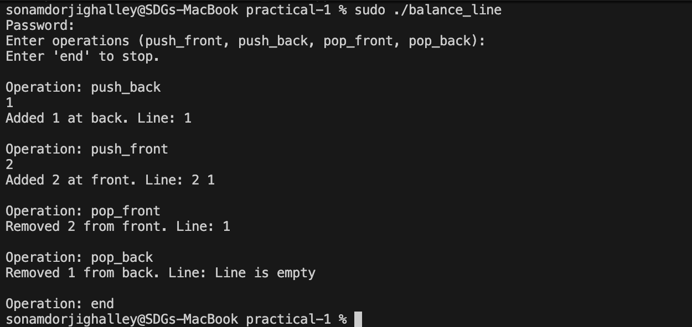
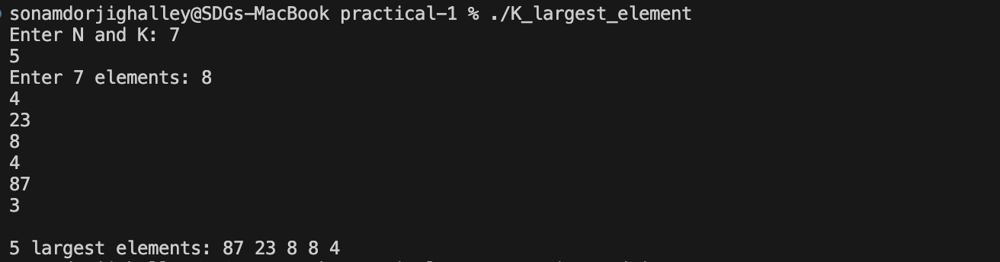
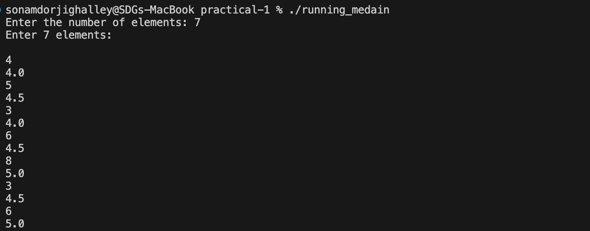
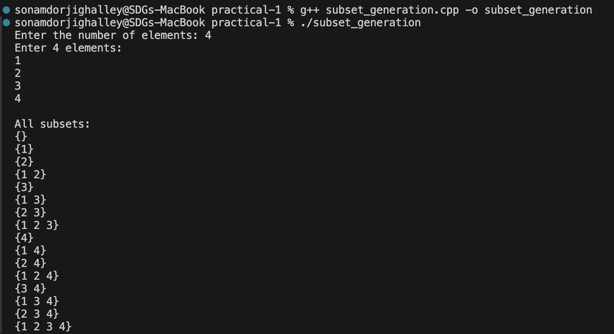
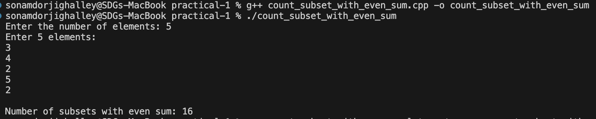
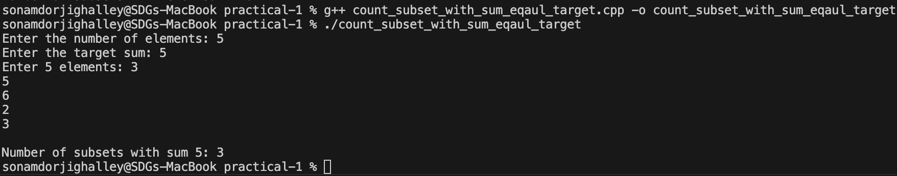

# CSF303 Practical 1

## Files

- [dynamic_array_basics.cpp](#1-dynamic-array-basics) - Problem 1
- [reverse_the_array.cpp](#2-reverse-the-array) - Problem 2
- [remove_duplicates.cpp](#3-remove-duplicates) - Problem 3
- [sliding_window_maximun.cpp](#4-sliding-window-maximum) - Problem 4
- [balance_line.cpp](#5-balanced-line-problem) - Problem 5
- [K_largest_element.cpp](#6-k-largest-elements) - Problem 6
- [running_medain.cpp](#7-running-median) - Problem 7
- [subset_generation.cpp](#8-subset-generation) - Problem 8
- [count_subset_with_even_sum.cpp](#9-count-subsets-with-even-sum) - Problem 9
- [count_subset_with_sum_eqaul_target.cpp](#10-count-of-subsets-with-sum-equal-to-target) - Problem 10

---

## Overview

This practical focuses on fundamental data structures and algorithms including vectors, deques, priority queues, and dynamic programming techniques.

---

## Problems and Solutions

### 1. Dynamic Array Basics

**Problem Summary:**
Create a dynamic array, store N integers, and perform basic operations like insertion, deletion, and traversal.

**Algorithm Explanation:**
Using C++ vector to dynamically allocate memory for storing integers. Elements are inserted sequentially and can be accessed or modified at any index.

**Time Complexity:**

- Access: O(1)
- Insertion (at end): O(1) gradually adding elements
- Deletion: O(n)

**Space Complexity:**
O(n) where n is the number of elements

**Reflection:**
This problem introduces me with the vector container and dynamic memory allocation. Vectors are more flexible than static arrays as they grow automatically.

**output:**

---

### 2. Reverse the Array

**Problem Summary:**
Given N integers in a vector, printing them in reverse order using backward traversal.

**Algorithm Explanation:**
Traversing the array from the last index (n-1) down to 0, printing each element with proper spacing.

**Time Complexity:**
O(n) - single pass through the array

**Space Complexity:**
O(n) - storage for n elements

**Reflection:**
Demonstrating reverse traversal using a for loop with decrementing index. Simple but effective approach for reversing array output without modifying the original array.

**output:**

---

### 3. Remove Duplicates

**Problem Summary:**
Remove duplicate elements from N integers and print only unique values in sorted order.

**Algorithm Explanation:**

1. Sorting the array using `std::sort`
2. Iterating through sorted array and print only elements that differ from the previous one

**Time Complexity:**
O(n log n) - dominated by sorting

**Space Complexity:**
O(n) - storaging for n elements

**Reflection:**
Sorting first makes duplicate detection trivial (comparing adjacent elements). A more advanced approach would use a hash set for O(n) average time.

**output:**

---

### 4. Sliding Window Maximum

**Problem Summary:**
Finding the maximum element in every window of size K sliding across an array of N integers.

**Algorithm Explanation:**
Using a deque to store indices of useful elements in decreasing order of their values:

1. Removing indices outside the current window
2. Removing indices of elements smaller than the current element
3. The front of deque always contains the maximum index for current window

**Time Complexity:**
O(n) - each element is added and removed once

**Space Complexity:**
O(k) - maximum deque size is k

**Reflection:**
Deques are perfect for this problem as they support O(1) operations at both ends. The key insight is storing indices rather than values for tracking window boundaries.

**output:**

## 

### 5. Balanced Line Problem

**Problem Summary:**
Simulating a queue with operations: push_front, push_back, pop_front, pop_back. Printing the line after each operation.

**Algorithm Explanation:**
Use a deque to support insertion and deletion from both ends. For each operation, modify the deque accordingly and print current state.

**Time Complexity:**
O(1) per operation, O(n) for printing

**Space Complexity:**
O(n) - storage for queue elements

**Reflection:**
Deques (double-ended queues) are ideal when we need efficient operations at both ends. This problem demonstrates practical queue manipulation.

**output:**

---

### 6. K Largest Elements

**Problem Summary:**
Given N numbers, identify and print the K largest elements in descending order.

**Algorithm Explanation:**
Using a max heap (priority_queue in C++). Push all elements into the heap, then extract the top K elements. The heap automatically maintains elements in descending order.

**Time Complexity:**

- Building heap: O(n)
- Extracting K elements: O(k log n)
- Total: O(n + k log n)

**Space Complexity:**
O(n) - storage in priority queue

**Reflection:**
Priority queues (heaps) are efficient for finding top-K elements. Without sorting the entire array, we get O(log n) operations per extraction.

**output:**

---

### 7. Running Median

**Problem Summary:**
Process a stream of integers and find the median after adding each element. Print each median to 1 decimal place.

**Algorithm Explanation:**
Maintain two heaps:

- Max heap for lower half of elements
- Min heap for upper half of elements
  Keep heaps balanced (max heap size ≤ min heap size + 1). Median is either the top of max heap (odd total) or average of both tops (even total).

**Time Complexity:**
O(n log n) - adding each element takes O(log n)

**Space Complexity:**
O(n) - storage for n elements across both heaps

**Reflection:**
This is an elegant solution using two heaps. It demonstrates the power of maintaining balanced data structures for efficient online algorithms.

**output:**

---

### 8. Subset Generation

**Problem Summary:**
Generating all possible subsets (power set) of N given numbers using bitmask technique.

**Algorithm Explanation:**
Using bitmask from 0 to 2^n - 1. Each bit position represents whether an element is included:

- Bit i set = include arr[i] in subset
- Iterate through all 2^n masks and build subsets

**Time Complexity:**
O(n × 2^n) - generating and printing 2^n subsets of average size n/2

**Space Complexity:**
O(1) excluding output (or O(2^n) if storing all subsets)

**Reflection:**
Bitmask technique is elegant for subset generation. Each number from 0 to 2^n-1 represents a unique subset. Understanding bit operations is crucial.

**output:**

---

### 9. Count Subsets with Even Sum

**Problem Summary:**
Counting how many subsets of N numbers have an even sum.

**Algorithm Explanation:**
Generating all 2^n subsets using bitmask. For each subset, calculating the sum and check if divisible by 2. Incrementing counter for even sums.

**Time Complexity:**
O(n × 2^n) - checking all subsets

**Space Complexity:**
O(n) - array storage

**Reflection:**
While bitmask approach works, there's a mathematical insight: if array has at least one even number, exactly half of subsets have even sum. This shows the value of mathematical analysis beyond brute-force.

**output:**

---

### 10. Count of Subsets with Sum Equal to Target

**Problem Summary:**
Finding the number of subsets whose sum equals a given target value.

**Algorithm Explanation:**
Dynamic programming approach:

- `dp[i][j]` = count of subsets using first i elements with sum j
- Base case: `dp[i][0] = 1` (empty subset)
- Recurrence: `dp[i][j] = dp[i-1][j] + dp[i-1][j-arr[i-1]]` (exclude or include element)

**Time Complexity:**
O(n × target) - filling DP table

**Space Complexity:**
O(n × target) - 2D DP array, optimizable to O(target)

**Reflection:**
DP solution is much more efficient than bitmask for problems with large values. This demonstrates the importance of choosing the right algorithmic approach based on problem constraints.

**output:**

---

## Key Learnings

1. **Data Structures**: Vectors for dynamic arrays, deques for double-ended operations, priority queues for heaps
2. **Problem-solving techniques**: Bitmasks for subsets, two heaps for streaming data, DP for subset sum
3. **Complexity analysis**: Understanding time/space tradeoffs in different approaches
4. **C++ STL**: Effective use of standard library containers and algorithms

---
