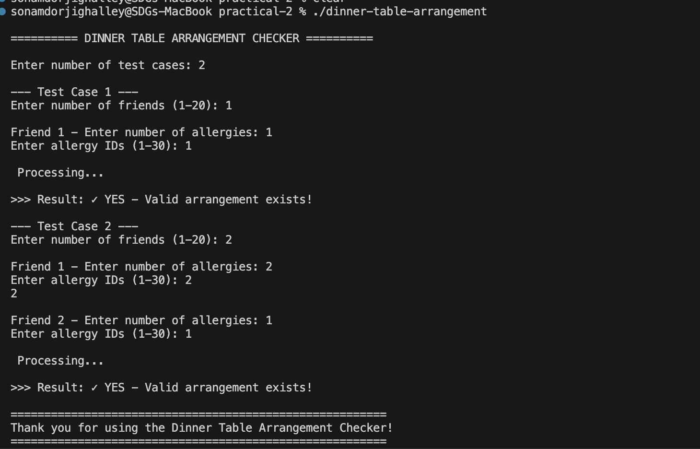
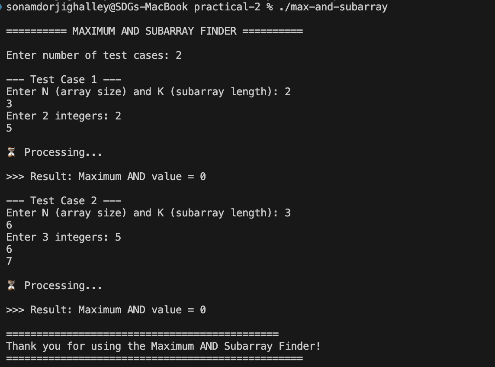
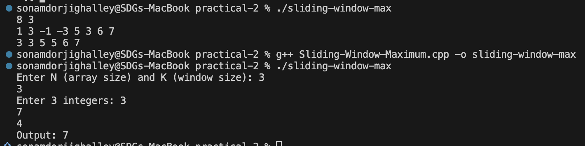
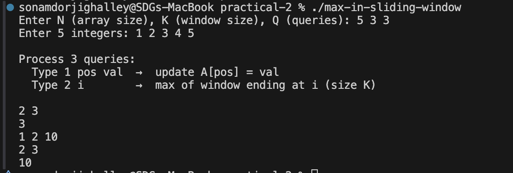
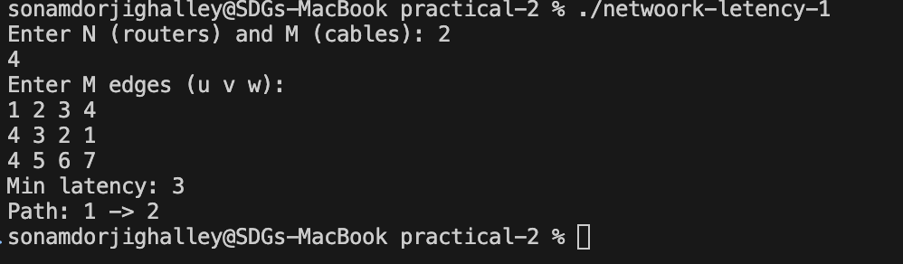
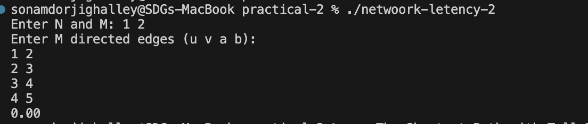
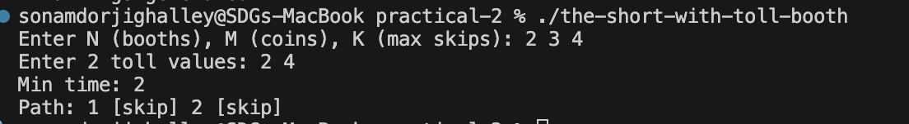

# Practical 2 - Advanced Data Structures & Algorithms

A collection of 7 advanced algorithmic challenges covering dynamic programming, segment trees, deques, bitmasks, and graph algorithms.

---

## Table of Contents

1. [Dinner Table Arrangements](#1-dinner-table-arrangements)
2. [Maximum AND Subarray](#2-maximum-and-subarray)
3. [Sliding Window Maximum](#3-sliding-window-maximum)
4. [Maximum in Sliding Window with Updates](#4-maximum-in-sliding-window-with-updates)
5. [Network Latency 1](#5-network-latency-1)
6. [Network Latency 2](#6-network-latency-2)
7. [The Shortest Path with Toll Booths](#7-the-shortest-path-with-toll-booths)

---

## 1. Dinner Table Arrangements

### Problem Description

Given a set of friends with various food allergies, determine if it's possible to arrange them in a straight line at a dinner table such that no two adjacent friends share a common allergy.

### Algorithm

**Bitmask Dynamic Programming**

- Use a bitmask to represent which friends are included in the arrangement
- `dp[mask][i]` = true if people in 'mask' can be arranged with person 'i' at the end
- For each state, try adding each remaining person if they have no common allergies
- Check if any person can be at the end of the full arrangement

### Key Features

- **Time Complexity:** O(2^n × n²)
- **Space Complexity:** O(2^n × n)
- Constraint: n ≤ 20
- Supports up to 30 allergy types using integer bitmask

### Input Format

```
Number of test cases
For each test case:
  N (number of friends)
  For each friend: number of allergies, then allergy IDs (1-30)
```

### Source Code

 **[View Full Code: Dinner-Table-Arrangements.cpp](./Dinner-Table-Arrangements.cpp)**

### Usage

```bash
g++ -o Dinner-Table-Arrangements Dinner-Table-Arrangements.cpp
./Dinner-Table-Arrangements
```

### Example

```
Input:
  2 (friends)
  Friend 1: 1 allergy → ID: 1
  Friend 2: 1 allergy → ID: 2

Output: YES - Valid arrangement exists!
```

### Algorithm Visualization



---

## 2. Maximum AND Subarray

### Problem Description

Given an array of N integers and a subarray length K, find the maximum AND value among all contiguous subarrays of length K.

### Algorithm

**Brute Force with Bitwise AND**

- Iterate through all subarrays of length K
- For each subarray, compute the AND of all elements
- Track the maximum AND value found

### Key Features

- **Time Complexity:** O(n × k)
- **Space Complexity:** O(n)
- Tests multiple test cases
- Handles both positive and negative integers

### Input Format

```
Number of test cases
For each test case:
  N K (array size, subarray length)
  N space-separated integers
```

### Source Code

 **[View Full Code: Maximum-AND-Subarray.cpp](./Maximum-AND-Subarray.cpp)**

### Usage

```bash
g++ -o Maximum-AND-Subarray Maximum-AND-Subarray.cpp
./Maximum-AND-Subarray
```

### Example

```
Input:
  N=5, K=3
  Array: 12 8 4 2 6

Output: Maximum AND value = 0
```

### Algorithm Visualization



---

## 3. Sliding Window Maximum

### Problem Description

Given an array of N integers and a window size K, find the maximum element in each sliding window as it moves from left to right.

### Algorithm

**Deque-Based Approach**

- Maintain a deque of indices in decreasing order of array values
- For each new element:
  - Remove indices outside the current window
  - Remove indices with smaller values (they can never be max while larger elements exist)
  - Add current index to deque
  - The front of deque contains the max for current window

### Key Features

- **Time Complexity:** O(n) - Each element enters and leaves deque once
- **Space Complexity:** O(k) - Deque stores at most k indices
- Optimal for this problem
- No output formatting overhead

### Input Format

```
N K (array size, window size)
N space-separated integers (can be negative)
```

### Source Code

**[View Full Code: Sliding-Window-Maximum.cpp](./Sliding-Window-Maximum.cpp)**

### Usage

```bash
g++ -o Sliding-Window-Maximum Sliding-Window-Maximum.cpp
./Sliding-Window-Maximum
```

### Example

```
Input:
  8 3
  1 3 -1 -3 5 3 6 7

Output: 3 3 5 5 6 7
```

### Algorithm Visualization



---

## 4. Maximum in Sliding Window with Updates

### Problem Description

Given an array with two types of queries:

1. **Type 1:** Update element at position `pos` to value `val`
2. **Type 2:** Find maximum element in a sliding window of size K ending at position `i`

### Algorithm

**Segment Tree with Range Maximum Query**

- Build a segment tree to support efficient range queries
- For updates: Modify the tree in O(log n) time
- For queries: Answer range max queries in O(log n) time

### Key Features

- **Time Complexity:** O(n) build + O(q × log n) queries
- **Space Complexity:** O(4n) - Segment tree
- Supports both static and dynamic queries
- Better than naive O(n) per query approach

### Input Format

```
N K Q (array size, window size, number of queries)
N space-separated integers
Q queries (each: type [1/2] [pos val] or [idx])
```

### Source Code

 **[View Full Code: Maximum-in-Sliding-Window-with-Updates(1).cpp](./Maximum-in-Sliding-Window-with-Updates(1).cpp)**

### Usage

```bash
g++ -o Maximum-in-Sliding-Window-with-Updates "Maximum-in-Sliding-Window-with-Updates(1).cpp"
./Maximum-in-Sliding-Window-with-Updates
```

### Example

```
Input:
  5 3 3
  1 2 3 4 5
  2 3        (max of window ending at 3: [1,2,3])
  1 2 10     (update position 2 to 10)
  2 3        (max of window ending at 3: [10,3,4])

Output:
  3
  10
```

### Algorithm Visualization



---

## 5. Network Latency 1

### Problem Description

Find the minimum latency path from router 1 to router N in a network graph where edges have constant travel times (weights).

### Algorithm

**Dijkstra's Shortest Path Algorithm**

- Use a priority queue to always process the closest unvisited node
- Track distance to each node and parent pointers for path reconstruction
- Find shortest path from node 1 to node N

### Key Features

- **Time Complexity:** O((V + E) log V) with priority queue
- **Space Complexity:** O(V + E)
- Handles large graphs efficiently
- Returns both minimum latency and the path taken

### Input Format

```
N M (number of routers, number of cables/edges)
M edges: u v weight
```

### Source Code

**[View Full Code: Network-Latency-1.cpp](./Network-Latency-1.cpp)**

### Usage

```bash
g++ -o Network-Latency-1 Network-Latency-1.cpp
./Network-Latency-1
```

### Example

```
Input:
  4 5
  1 2 1
  1 3 4
  2 3 2
  2 4 5
  3 4 1

Output:
  Min latency: 4
  Path: 1 -> 2 -> 3 -> 4
```

### Algorithm Visualization



---

## 6. Network Latency 2

### Problem Description

Find minimum latency in a network where travel time on each edge is a function of arrival time: **time = a×t + b**, where t is the arrival time at the source node.

### Algorithm

**Modified Dijkstra's with Dynamic Edge Weights**

- Similar to standard Dijkstra's algorithm
- Key difference: edge weight depends on when we arrive at the current node
- Formula: `arrival_time_at_v = d + a×d + b` where d is arrival at current node
- Handle floating-point calculations for non-linear travel times

### Key Features

- **Time Complexity:** O((V + E) log V)
- **Space Complexity:** O(V + E)
- Handles time-dependent edge weights
- Uses double precision for accuracy
- Returns minimum latency as floating-point value

### Input Format

```
N M (number of routers, number of directed edges)
M edges: u v a b (where travel_time = a*arrival_time + b)
```

### Source Code

**[View Full Code: Network-Latency-2.cpp](./Network-Latency-2.cpp)**

### Usage

```bash
g++ -o Network-Latency-2 Network-Latency-2.cpp
./Network-Latency-2
```

### Example

```
Input:
  3 3
  1 2 0.5 1
  2 3 0.5 2
  1 3 1.0 0

Output: 2.50 (or similar, depending on the graph structure)
```

### Algorithm Visualization



---

## 7. The Shortest Path with Toll Booths

### Problem Description

Navigate through N toll booths from booth 1 to booth N with the following rules:

- **Pay:** Spend 1 coin at a booth (costs 1 minute)
- **Skip:** Don't pay (costs 2 minutes), can skip at most K booths
- Start with M coins and maximize remaining coins or minimize total time

### Algorithm

**Dynamic Programming with State Reconstruction**

- `dp[i][j]` = minimum time to reach booth i using j skips
- `coins[i][j]` = maximum coins left after reaching booth i with j skips
- Two transitions per booth:
  - Pay toll (if have enough coins)
  - Skip booth (if skips remaining)
- Reconstruct path by backtracking through parent pointers

### Key Features

- **Time Complexity:** O(n × k)
- **Space Complexity:** O(n × k)
- Handles trade-offs: time vs coins vs skips
- Returns optimal path with booth actions (pay/skip)

### Input Format

```
N M K (number of booths, starting coins, max skips)
N space-separated toll values
```

### Source Code

**[View Full Code: The-Shortest-Path-with-Toll-Booths.cpp](./The-Shortest-Path-with-Toll-Booths.cpp)**

### Usage

```bash
g++ -o The-Shortest-Path-with-Toll-Booths The-Shortest-Path-with-Toll-Booths.cpp
./The-Shortest-Path-with-Toll-Booths
```

### Example

```
Input:
  4 5 1
  1 2 3 1

Output:
  Min time: 3
  Path: 1 [skip] 2 [skip] 3 [pay] 4 [pay]
```

### Algorithm Visualization



---

## Compilation & Execution

### Compile All Files

```bash


# Compile individual files
g++ -o Dinner-Table-Arrangements Dinner-Table-Arrangements.cpp
g++ -o Maximum-AND-Subarray Maximum-AND-Subarray.cpp
g++ -o Sliding-Window-Maximum Sliding-Window-Maximum.cpp
g++ -o Maximum-in-Sliding-Window-with-Updates.cpp 
g++ -o Network-Latency-1 Network-Latency-1.cpp
g++ -o Network-Latency-2 Network-Latency-2.cpp
g++ -o The-Shortest-Path-with-Toll-Booths The-Shortest-Path-with-Toll-Booths.cpp
```

### Run Individual Programs

```bash
./Dinner-Table-Arrangements
./Maximum-AND-Subarray
./Sliding-Window-Maximum
./Maximum-in-Sliding-Window-with-Updates
./Network-Latency-1
./Network-Latency-2
./The-Shortest-Path-with-Toll-Booths
```

### Run with Input Piping

```bash
# Example: Test Sliding Window Maximum
echo "8 3
1 3 -1 -3 5 3 6 7" | ./Sliding-Window-Maximum
```

---

## Summary Comparison

| #   | Problem                                | Algorithm            | Time Complexity | Space Complexity | Difficulty |
| --- | -------------------------------------- | -------------------- | --------------- | ---------------- | ---------- |
| 1   | Dinner Table Arrangements              | Bitmask DP           | O(2^n × n²)     | O(2^n × n)       | Hard       |
| 2   | Maximum AND Subarray                   | Brute Force          | O(n × k)        | O(n)             | Easy       |
| 3   | Sliding Window Maximum                 | Deque                | O(n)            | O(k)             | Medium     |
| 4   | Maximum in Sliding Window with Updates | Segment Tree         | O(n + q log n)  | O(4n)            | Hard       |
| 5   | Network Latency 1                      | Dijkstra's           | O((V+E) log V)  | O(V+E)           | Medium     |
| 6   | Network Latency 2                      | Dijkstra's (Dynamic) | O((V+E) log V)  | O(V+E)           | Medium     |
| 7   | Toll Booths Shortest Path              | DP + Reconstruction  | O(n × k)        | O(n × k)         | Hard       |

---

## Key Learning Objectives

- Master bitmask dynamic programming for combinatorial problems
- Understand deque-based optimization for sliding window problems
-  Implement and use segment trees for range queries
- Apply Dijkstra's algorithm to network optimization
- Handle time-dependent and non-linear graph weights
- Solve complex DP problems with state reconstruction

---

## Notes & Performance Optimization

- **Fast I/O:** All programs use `ios_base::sync_with_stdio(false)` for faster input/output
- **Memory:** Bitmask DP programs are limited to n ≤ 20 due to 2^n memory requirement
- **Precision:** Network Latency 2 uses `double` for floating-point calculations
- **Output Buffer:** Use `"\n"` instead of `endl` for better performance

---


