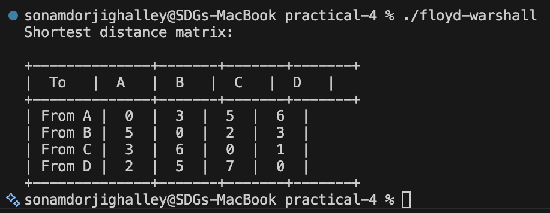
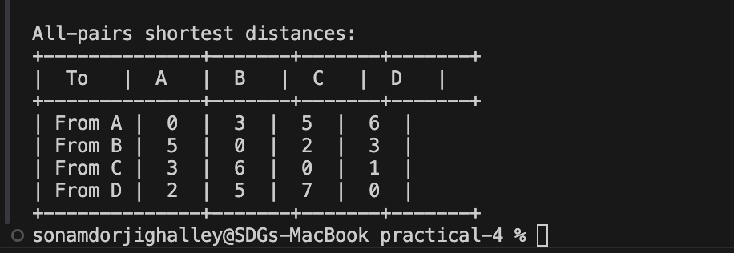
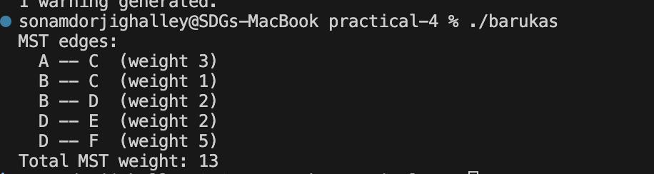

# Practical-4: Graph Algorithms Report

## Overview

This practical implements three essential graph algorithms for solving different graph problems:

- **Floyd-Warshall**: All-pairs shortest paths
- **Johnson's Algorithm**: All-pairs shortest paths with better performance for sparse graphs
- **Borůvka's Algorithm**: Minimum Spanning Tree (MST)

---

## 1. Floyd-Warshall Algorithm

### File: `floyd-warshall.cpp`

### Algorithm Explanation

Floyd-Warshall is a dynamic programming algorithm that computes the shortest paths between all pairs of vertices in a weighted graph. It works by considering each vertex as an intermediate waypoint and updating distances if a shorter path is found.

**Key Steps:**

1. Initialize a distance matrix from the adjacency matrix of the graph
2. For each intermediate vertex `k` (0 to n-1):
   - For each pair of vertices `(i, j)`:
     - Check if going through vertex `k` provides a shorter path
     - Update `dist[i][j] = min(dist[i][j], dist[i][k] + dist[k][j])`
3. The final matrix contains shortest paths between all pairs

**Graph Used:**

- 4 vertices: A, B, C, D
- Directed weighted edges with specified distances

### Time Complexity

- **Best Case:** O(n³)
- **Average Case:** O(n³)
- **Worst Case:** O(n³)

All three cases are the same because of the three nested loops that iterate through all vertices.

### Space Complexity

- **Auxiliary Space:** O(n²) for the distance matrix

### Output

---

## 2. Johnson's Algorithm

### File: `johnsons.cpp`

### Algorithm Explanation

Johnson's Algorithm combines Bellman-Ford and Dijkstra algorithms to compute all-pairs shortest paths efficiently. It is especially useful for sparse graphs as it avoids the O(n³) complexity of Floyd-Warshall.

**Key Components:**

1. **Bellman-Ford Phase:**
   - Creates a virtual node connected to all vertices with weight 0
   - Computes potential values `h[]` from this virtual node
   - Detects negative cycles if present
   - Time: O(VE)

2. **Reweighting Phase:**
   - Adjusts edge weights using: `new_weight = old_weight + h[u] - h[v]`
   - Makes all edge weights non-negative while preserving shortest paths
   - Time: O(E)

3. **Dijkstra Phase:**
   - Runs Dijkstra from each vertex as source on the reweighted graph
   - Computes shortest paths from each source to all destinations
   - Time: O(V × (E log V)) = O(VE log V)

4. **Restoration Phase:**
   - Converts reweighted distances back to original distances:
   - `original_dist = reweighted_dist + h[v] - h[u]`
   - Time: O(V²)

**Graph Used:**

- 4 vertices: A, B, C, D
- Directed edges with weights including potential negative values

### Time Complexity

- **Bellman-Ford:** O(VE)
- **Dijkstra (V times):** O(VE log V)
- **Total:** O(VE log V) ≈ O(V² log V + VE)

For dense graphs: O(V³) - equivalent to Floyd-Warshall
For sparse graphs (E = O(V)): O(V² log V) - better than Floyd-Warshall

### Space Complexity

- **Auxiliary Space:** O(V²) for distance matrix + O(V + E) for adjacency list

### Output Example

---

## 3. Borůvka's Algorithm

### File: `barukas.cpp`

### Algorithm Explanation

Borůvka's Algorithm is used to find the Minimum Spanning Tree (MST) of a connected weighted graph. It works by repeatedly finding and adding the minimum weight edge that connects different components.

**Key Steps:**

1. **Initialize** Union-Find data structure with each vertex as a separate component
2. **While** more than one component exists:
   - For each component, find the cheapest edge connecting it to another component
   - Store these edges in the `cheapest[]` array
   - For each identified cheapest edge, unite the components if they're different
   - Add the edge to MST and update total weight
   - Decrement component count
3. **Terminate** when all vertices are in one component

**Union-Find Operations:**

- `find(x)`: Finds the root of component containing x (path compression)
- `unite(x, y)`: Merges two components (union by rank)

**Graph Used:**

- 6 vertices: A, B, C, D, E, F
- 8 undirected weighted edges

### Time Complexity

- **Without Union-Find optimization:** O(E log V)
- **With path compression & union by rank:** O(E log E) or O(E log V)
  - E iterations of finding cheapest edges: O(E)
  - V iterations of outer loop: O(V)
  - Total: O(E log V) where E can be at most V edges in MST

In practice: O((E + V) log V)

### Space Complexity

- **Auxiliary Space:** O(V + E)
  - Union-Find structure: O(V)
  - Edge list: O(E)
  - MST result: O(V) for V-1 edges

### Output 

---

## Comparison Table

| Algorithm          | Problem                  | Time Complexity | Space Complexity | Best Use Case                                             |
| ------------------ | ------------------------ | --------------- | ---------------- | --------------------------------------------------------- |
| **Floyd-Warshall** | All-pairs shortest paths | O(V³)           | O(V²)            | Small dense graphs, negative weights (no negative cycles) |
| **Johnson's**      | All-pairs shortest paths | O(VE log V)     | O(V²)            | Sparse graphs, non-negative or moderate negative weights  |
| **Borůvka's**      | Minimum Spanning Tree    | O(E log V)      | O(V + E)         | General purpose MST, works on disconnected graphs         |

---

## Notes for Implementation

- All three algorithms handle edge cases like disconnected components
- Algorithms can be extended to track paths (not just distances/MST)
- Implementation uses structured bindings (C++17 feature)
- Edge weights are represented as signed integers

---

## Conclusion

These three algorithms form the foundation of graph theory applications:

- **Floyd-Warshall** provides a straightforward O(V³) solution for all-pairs paths
- **Johnson's Algorithm** optimizes this for sparse graphs
- **Borůvka's Algorithm** efficiently finds minimum spanning trees in various graph types

Each has its optimal use case depending on graph density, weight constraints, and problem requirements.
