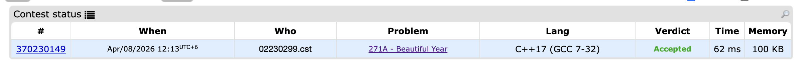
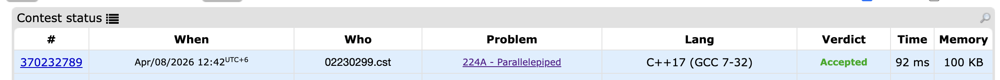
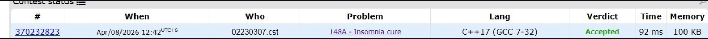
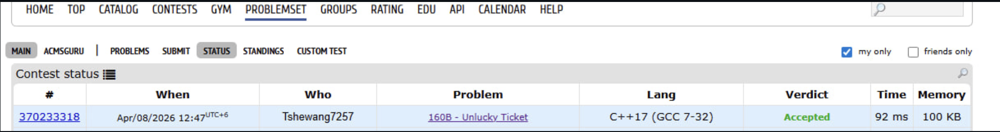
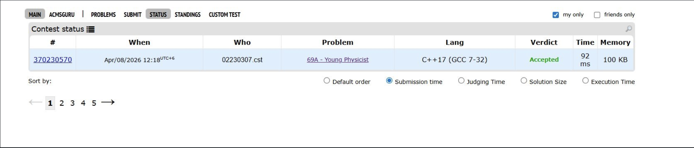
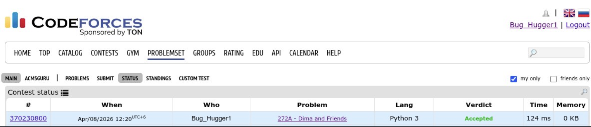
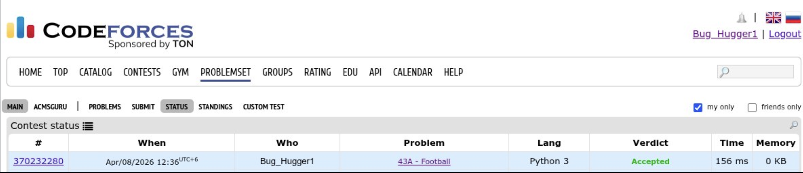
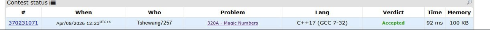

# 1. Beautiful Year - Code Report

## Overview

The **Beautiful Year** program finds the smallest year greater than a given year that contains all distinct digits (no repeated digits).

---

## Code Analysis

### 1. **Header Files and Namespaces**

```cpp
#include<iostream>
#include<set>
using namespace std;
```

| Component              | Purpose                                                         |
| ---------------------- | --------------------------------------------------------------- |
| `#include<iostream>`   | Provides input/output stream functionality (`cin`, `cout`)      |
| `#include<set>`        | Provides the `set` data structure for storing unique elements   |
| `using namespace std;` | Allows use of standard library functions without `std::` prefix |

---

### 2. **Function: `distinctDigits(int n)`**

```cpp
bool distinctDigits(int n) {
    set<int> digits;
    while (n > 0) {
        int d = n % 10;
        if (digits.count(d)) return false;
        digits.insert(d);
        n /= 10;
    }
    return true;
}
```

#### Purpose

Checks whether a given number has all distinct digits (no duplicates).

#### Step-by-Step Explanation

| Line(s) | Code                         | Explanation                                                  |
| ------- | ---------------------------- | ------------------------------------------------------------ |
| 1       | `bool distinctDigits(int n)` | Function declaration with integer parameter, returns boolean |
| 2       | `set<int> digits;`           | Creates an empty set to store digits of the number           |
| 3-7     | `while (n > 0)`              | Loop continues while the number has remaining digits         |
| 4       | `int d = n % 10;`            | Extracts the last digit using modulo operator                |
| 5       | `if (digits.count(d))`       | Checks if this digit already exists in the set               |
| 5       | `return false;`              | Returns false immediately if duplicate digit is found        |
| 6       | `digits.insert(d);`          | Adds the extracted digit to the set                          |
| 7       | `n /= 10;`                   | Removes the last digit from the number (integer division)    |
| 8       | `return true;`               | Returns true if loop completes (all digits are distinct)     |

#### Algorithm Logic

- Extracts digits from right to left using `n % 10`
- Uses a `set` to track previously seen digits
- If any digit appears twice, returns `false`
- If all digits are unique, returns `true`

---

### 3. **Main Function**

```cpp
int main() {
    int y;
    cin >> y;
    y++;
    while (!distinctDigits(y)) y++;
    cout << y << endl;
}
```

#### Step-by-Step Explanation

| Line | Code                         | Explanation                                                |
| ---- | ---------------------------- | ---------------------------------------------------------- |
| 1    | `int y;`                     | Declares integer variable to store the input year          |
| 2    | `cin >> y;`                  | Reads the year from user input                             |
| 3    | `y++;`                       | Increments the year by 1 (start checking from next year)   |
| 4    | `while (!distinctDigits(y))` | Loop continues while year does NOT have distinct digits    |
| 4    | `y++;`                       | Increments year until a year with distinct digits is found |
| 5    | `cout << y << endl;`         | Outputs the beautiful year and moves to new line           |

#### Algorithm Logic

1. Takes a year as input
2. Increments it by 1 (to ensure the result is greater than input)
3. Keeps incrementing until finding a year with all distinct digits
4. Outputs and terminates

---

## Example Execution

### Input: `1987`

1. Read year: `1987`
2. Increment: `1988`
3. Check `1988` → has duplicate `8` → Not beautiful
4. Increment: `1989` → has no duplicates → **Beautiful!**
5. Output: `1989`

### Input: `2005`

1. Read year: `2005`
2. Increment: `2006` → has duplicate `0` → Not beautiful
3. Keep incrementing...
4. Eventually output: `2013` (first year after 2005 with all distinct digits)

---

## Time Complexity Analysis

- **`distinctDigits()` function:** O(log n) where n is the input number (at most 10 digits in a year)
- **Main loop:** O(k × log n) where k is the difference between input and result year
- **Overall:** Efficient for practical year ranges

---

## Output



**Description of expected output:**
The program will display a single integer representing the next beautiful year.

---

## Key Concepts Used

| Concept              | Usage                                     |
| -------------------- | ----------------------------------------- |
| `set` data structure | Tracks unique digits to detect duplicates |
| Modulo operator `%`  | Extracts individual digits from number    |
| Integer division `/` | Removes processed digits from number      |
| Boolean function     | Returns true/false for validation         |
| While loop           | Iterates until condition is met           |

---

## Conclusion

The Beautiful Year program efficiently finds years with all distinct digits by employing a digit extraction technique and set-based duplicate detection. It's an elegant solution combining number manipulation with data structures.

---

# 2. Parallelepiped - Code Report

## Overview

The **Parallelepiped** program calculates the sum of all edges of a rectangular parallelepiped (3D box) given the products of three pairs of its dimensions.

---

## Code Analysis

### A. **Header Files and Namespaces**

```cpp
#include<iostream>
#include<cmath>
using namespace std;
```

| Component              | Purpose                                                         |
| ---------------------- | --------------------------------------------------------------- |
| `#include<iostream>`   | Provides input/output stream functionality (`cin`, `cout`)      |
| `#include<cmath>`      | Provides mathematical functions like `sqrt()` and `round()`     |
| `using namespace std;` | Allows use of standard library functions without `std::` prefix |

---

### B. **Main Function with Mathematical Logic**

```cpp
int main() {
    long long ab, bc, ac;
    cin >> ab >> bc >> ac;

    // ab = a*b, bc = b*c, ac = a*c
    // a*b * a*c / b*c = a^2  =>  a = sqrt(ab*ac/bc)
    long long a = round(sqrt((double)ab * ac / bc));
    long long b = ab / a;
    long long c = bc / b;

    cout << 4 * (a + b + c) << endl;
}
```

#### Purpose

Determines the three dimensions (a, b, c) of a parallelepiped from the products of pairs of dimensions, then calculates the total sum of all edges.

#### Step-by-Step Explanation

| Line(s) | Code                                               | Explanation                                                                                             |
| ------- | -------------------------------------------------- | ------------------------------------------------------------------------------------------------------- |
| 1-2     | `long long ab, bc, ac;`                            | Declares three variables to store the products of dimension pairs (uses `long long` for larger numbers) |
| 3       | `cin >> ab >> bc >> ac;`                           | Reads three products from user input                                                                    |
| 6       | `// ab = a*b, bc = b*c, ac = a*c`                  | Comment explaining what each input represents                                                           |
| 7       | `// a*b * a*c / b*c = a^2`                         | Mathematical derivation: (ab × ac) / bc simplifies to a²                                                |
| 8       | `long long a = round(sqrt((double)ab * ac / bc));` | Calculates dimension `a` using the formula                                                              |
| 9       | `long long b = ab / a;`                            | Calculates dimension `b` using: ab ÷ a = b                                                              |
| 10      | `long long c = bc / b;`                            | Calculates dimension `c` using: bc ÷ b = c                                                              |
| 12      | `cout << 4 * (a + b + c) << endl;`                 | Outputs the sum of all 12 edges                                                                         |
---

### Mathematical Derivation
---

Given:

- ab = a × b
- bc = b × c
- ac = a × c

To find `a`:
$$\frac{ab \times ac}{bc} = \frac{(a \times b) \times (a \times c)}{b \times c} = \frac{a^2 \times b \times c}{b \times c} = a^2$$

Therefore: $$a = \sqrt{\frac{ab \times ac}{bc}}$$

To find `b` and `c`:

- $$b = \frac{ab}{a}$$
- $$c = \frac{bc}{b}$$

#### Edge Sum Calculation

A rectangular parallelepiped has:

- 4 edges of length `a`
- 4 edges of length `b`
- 4 edges of length `c`

**Total sum = 4a + 4b + 4c = 4(a + b + c)**

---

### 3. **Data Type Considerations**

| Data Type   | Reason                                                                                        |
| ----------- | --------------------------------------------------------------------------------------------- |
| `long long` | Used for input/output to handle larger product values that may not fit in `int`               |
| `double`    | Type casting in calculation to ensure precision during square root operation                  |
| `round()`   | Rounds the calculated value to nearest integer to account for floating-point precision errors |

---

## Example Execution

### Input: `2 3 6`

- ab = 2 (a × b = 2)
- bc = 3 (b × c = 3)
- ac = 6 (a × c = 6)

**Calculations:**

1. a² = (2 × 6) / 3 = 12 / 3 = 4 → a = 2
2. b = 2 / 2 = 1
3. c = 3 / 1 = 3
4. **Sum of edges = 4(2 + 1 + 3) = 4 × 6 = 24**

### Input: `12 15 20`

- ab = 12
- bc = 15
- ac = 20

**Calculations:**

1. a² = (12 × 20) / 15 = 240 / 15 = 16 → a = 4
2. b = 12 / 4 = 3
3. c = 15 / 3 = 5
4. **Sum of edges = 4(4 + 3 + 5) = 4 × 12 = 48**

---

## Time Complexity Analysis

- **Square root calculation:** O(1) - performed once
- **Division operations:** O(1) - three simple arithmetic operations
- **Overall:** O(1) constant time complexity

---

## Output



**Description of expected output:**
The program will display a single integer representing the sum of all 12 edges of the parallelepiped.

---

## Key Concepts Used

| Concept                  | Usage                                           |
| ------------------------ | ----------------------------------------------- |
| Algebraic manipulation   | Deriving formula for dimensions                 |
| `sqrt()` function        | Computing square root for finding dimension `a` |
| `round()` function       | Handling floating-point precision errors        |
| Type casting to `double` | Ensuring precision in division                  |
| Arithmetic operations    | Calculating remaining dimensions                |

---

## Validation Method

The solution can be verified by checking:

- (a × b) should equal ab
- (b × c) should equal bc
- (a × c) should equal ac

If all three conditions are true, the dimensions are correct and the edge sum is accurate.

---

## Conclusion

The Parallelepiped program elegantly solves a 3D geometry problem using algebraic manipulation and mathematical derivation. By extracting three dimensions from three pairwise products, it demonstrates how mathematical relationships can be exploited to solve computational problems efficiently.

---

# 3. Insomnia Cure

## Problem Description
A princess cannot fall asleep and imagines fighting dragons. Each dragon may suffer damage based on certain rules:

- Every **k-th** dragon gets punched with a frying pan.
- Every **l-th** dragon gets its tail shut in a balcony door.
- Every **m-th** dragon gets its paws trampled.
- Every **n-th** dragon gets threatened and runs away.

A dragon is considered **damaged** if it is affected by **any one** of these conditions.

Given the total number of dragons **d**, determine how many dragons are damaged.

---

## Input
Five integers are given, each on a separate line:

```

k
l
m
n
d

```

Where:

- **k, l, m, n** → conditions for damaging dragons
- **d** → total number of dragons

Constraints:

```

1 ≤ k, l, m, n ≤ 10
1 ≤ d ≤ 100000

```

---

## Output
Print a single integer representing the **number of damaged dragons**.

---

## Key Idea
A dragon is damaged if its number is divisible by **k**, **l**, **m**, or **n**.

For each dragon number **i (1 to d)**:

If:

```

i % k == 0
or i % l == 0
or i % m == 0
or i % n == 0

````

then that dragon is damaged.

---

## Algorithm
1. Read integers **k, l, m, n, d**.
2. Initialize **count = 0**.
3. Loop from **1 to d**.
4. For each dragon **i**:
   - Check if **i is divisible by k, l, m, or n**.
   - If yes, increase **count**.
5. Print **count**.

---

## Example 1

### Input

```
1
2
3
4
12
```

### Explanation

Since **k = 1**, every dragon number is divisible by **1**.

All dragons are damaged.

### Output

```
12
```

---

## Example 2

### Input

```
2
3
4
5
24
```

Dragons that **escape** damage:

```
1, 7, 11, 13, 17, 19, 23
```

Total dragons = **24**

Escaped = **7**

Damaged:

```
24 - 7 = 17
```

### Output

```
17
```

---

## Time Complexity

```
O(d)
```

We check each dragon once.

---

## Space Complexity

```
O(1)
```

Only a few variables are used.

---

## Conclusion

The problem is solved by checking whether each dragon number is divisible by **k, l, m, or n**. If any condition is satisfied, the dragon is counted as damaged.



---

# 4. Unlucky Number

### A. Problem Description

we are given a ticket containing `2n` digits. The ticket is **unlucky** if its first half and second half satisfy one of the following conditions after arranging the digits:

1. Each digit of the first half is **strictly less** than the corresponding digit of the second half.
2. Each digit of the first half is **strictly greater** than the corresponding digit of the second half.

Each digit must be used exactly once in the comparisons. If either of the above conditions is met, print `YES`; otherwise, print `NO`.

---

### Input

- The first line contains an integer `n` (1 ≤ n ≤ 100), the half-length of the ticket.  
- The second line contains a string of `2n` digits representing the ticket.

### Output

- Print `YES` if the ticket is definitely unlucky.  
- Print `NO` otherwise.

### Examples

**Example 1**  
```

Input:
2
2421
Output:
YES

```

**Example 2**  
```

Input:
2
0135
Output:
YES

```

**Example 3**  
```

Input:
2
3754
Output:
NO

````

---

## B. Solution Approach

1. **Split the ticket** into two halves:
   - `first_half = first n digits`
   - `second_half = last n digits`

2. **Sort both halves** in ascending order.

3. **Compare corresponding digits**:
   - If `first_half[i] < second_half[i]` for all `i`, the ticket is unlucky.
   - If `first_half[i] > second_half[i]` for all `i`, the ticket is unlucky.
   - Otherwise, the ticket is not unlucky.

**Rationale:**  
Sorting ensures that the smallest numbers are compared first. If any pair fails the strict comparison, no rearrangement can make the ticket meet the unluckiness criterion.

---

## C. Algorithm

1. Read integer `n` and ticket string `s`.  
2. Extract the first `n` digits as `first_half` and last `n` digits as `second_half`.  
3. Sort both `first_half` and `second_half`.  
4. Initialize two flags: `less = true`, `greater = true`.  
5. For each index `i` from `0` to `n-1`:
   - If `first_half[i] >= second_half[i]` → `less = false`  
   - If `first_half[i] <= second_half[i]` → `greater = false`  
6. If `less` or `greater` is `true`, print `YES`. Otherwise, print `NO`.

---

## D. Time Complexity

* Sorting two halves: `O(n log n)`
* Comparison loop: `O(n)`

**Overall:** `O(n log n)` → efficient for `n ≤ 100`.

---

## E. Conclusion

By sorting and comparing corresponding digits, we can determine if a ticket is definitely unlucky in an efficient manner. This approach guarantees correctness because any valid bijection that satisfies the criterion is represented by the sorted order comparison.

---

---


# 5. Young Physicist

## Problem Description
A student named Vasya was given a physics task. The body is located at coordinates **(0,0,0)** in space, and several forces act on it. Each force is represented as a vector with **x, y, and z components**.

The body will be **in equilibrium** if the **sum of all force vectors equals (0,0,0)**.  
If the total force is not zero, the body will move.

The task is to determine whether the body is in equilibrium.

---

## Input
- The first line contains an integer **n** (1 ≤ n ≤ 100) representing the number of force vectors.
- The next **n lines** each contain **three integers**:
  
```

xi yi zi

```

where:
- **xi** → force component along x-axis
- **yi** → force component along y-axis
- **zi** → force component along z-axis

Constraints:

```

-100 ≤ xi, yi, zi ≤ 100

```

---

## Output
Print:

- **"YES"** if the body is in equilibrium.
- **"NO"** if the body is not in equilibrium.

---

## Key Idea
To check equilibrium, calculate the sum of all vector components:

```

sumX = x1 + x2 + ... + xn
sumY = y1 + y2 + ... + yn
sumZ = z1 + z2 + ... + zn

```

If:

```

sumX = 0
sumY = 0
sumZ = 0

````

then the body is in equilibrium.

---

## Algorithm
1. Read integer **n**.
2. Initialize **sumX, sumY, sumZ = 0**.
3. For each vector:
   - Read **x, y, z**.
   - Add them to **sumX, sumY, sumZ**.
4. After the loop:
   - If all three sums are **0**, print **"YES"**.
   - Otherwise print **"NO"**.

---

## Example 1

### Input

```
3
4 1 7
-2 4 -1
1 -5 -3
```

### Calculation

```
sumX = 4 + (-2) + 1 = 3
sumY = 1 + 4 + (-5) = 0
sumZ = 7 + (-1) + (-3) = 3
```

Since not all sums are zero → **Output:**

```
NO
```

---

## Example 2

### Input

```
3
3 -1 7
-5 2 -4
2 -1 -3
```

### Calculation

```
sumX = 3 + (-5) + 2 = 0
sumY = -1 + 2 + (-1) = 0
sumZ = 7 + (-4) + (-3) = 0
```

All sums are zero → **Output:**

```
YES
```

---

## Time Complexity

```
O(n)
```

The program loops through the vectors once.

---

## Space Complexity

```
O(1)
```

Only a few variables are used regardless of input size.

---

## Conclusion

The problem is solved by checking whether the **sum of all force vectors equals zero in all three directions**. If the net force is zero, the body remains **in equilibrium**.


---

# 6. Beautiful Matrix

## Problem Description
we are given a **5 × 5 matrix** that contains **24 zeros and exactly one number 1**.

A matrix is considered **beautiful** if the number **1** is located in the **center cell**, which is position:

```

(3, 3)

```

can perform the following moves:

1. Swap two **neighboring rows**.
2. Swap two **neighboring columns**.

Each swap counts as **one move**.

The task is to determine the **minimum number of moves** needed to move the number **1** to the center of the matrix.

---

## Input
The input consists of **5 lines**, each containing **5 integers**.

```

0 0 0 0 0
0 0 0 0 1
0 0 0 0 0
0 0 0 0 0
0 0 0 0 0

```

The matrix contains:

- **24 zeros**
- **1 occurrence of the number 1**

---

## Output
Print a **single integer** representing the **minimum number of moves** required to move the **1** to the center of the matrix.

---

## Key Idea
To move the number **1** to position **(3,3)**, we calculate the **distance** between its current position and the center.

We use **Manhattan Distance**:

```

moves = |row - 3| + |column - 3|

```

Where:
- **row** → current row position of `1`
- **column** → current column position of `1`

This works because each swap moves the `1` **one step closer horizontally or vertically**.

---

## Algorithm
1. Read the **5 × 5 matrix**.
2. Find the position **(row, column)** of the number **1**.
3. Compute:

```

moves = |row - 3| + |column - 3|

````

4. Print the result.

---

## Example 1

### Input

```
0 0 0 0 0
0 0 0 0 1
0 0 0 0 0
0 0 0 0 0
0 0 0 0 0
```

Position of **1**:

```
(2,5)
```

Calculation:

```
|2 - 3| + |5 - 3|
= 1 + 2
= 3
```

### Output

```
3
```

---

## Example 2

### Input

```
0 0 0 0 0
0 0 0 0 0
0 1 0 0 0
0 0 0 0 0
0 0 0 0 0
```

Position of **1**:

```
(3,2)
```

Calculation:

```
|3 - 3| + |2 - 3|
= 0 + 1
= 1
```

### Output

```
1
```

---

## Time Complexity

```
O(25) ≈ O(1)
```

We only check **25 elements** in the matrix.

---

## Space Complexity

```
O(1)
```

No extra memory is required.

---

## Conclusion

The minimum number of moves required to make the matrix beautiful is the **Manhattan distance between the current position of 1 and the center (3,3)**.


---

# 7. Dima and Friends

## Problem Description

Dima and his friends played hide and seek all night, leaving Dima's apartment messy. To decide who should clean the apartment, they play a counting-out game.

All the participants stand in a circle. Each friend shows a number of fingers on one hand (from **1 to 5**). The total number of fingers shown is used to count around the circle starting from **Dima**. The person on whom the counting stops will have to clean the apartment.

Dima already knows how many fingers each of his friends will show. However, he can still choose how many fingers to show (from **1 to 5**). Dima wants to determine in how many ways he can choose a number of fingers such that **he does not end up cleaning the apartment**.

---

## Input

* The first line contains an integer **n** *(1 ≤ n ≤ 100)* representing the number of Dima's friends.
* The second line contains **n integers**, each between **1 and 5**, representing the number of fingers shown by each friend.

---

## Output

Print a single integer representing the **number of ways Dima can choose a number of fingers (1–5) so that he does not clean the apartment**.

---

## Algorithm / Approach

1. Read the number of friends **n**.

2. Read the number of fingers each friend shows and calculate their **total sum**.

3. The total number of people in the circle is:

   ```
   total_people = n + 1
   ```

4. Dima can show **1 to 5 fingers**, so check each possibility.

5. For each value **d (1–5)**:

   * Compute the total counting number:

   ```
   total = sum_of_friends + d
   ```

   * Determine the position where counting stops:

   ```
   position = total % total_people
   ```

6. If `position != 1`, the counting does not stop on Dima, meaning he does **not clean**.

7. Count how many such values exist.

---

## Time Complexity

The algorithm checks only **5 possible values** for Dima's fingers.

* Reading input: **O(n)**
* Checking possibilities: **O(5)**

Overall complexity:

```
O(n)
```

---

## Example

### Input

```
1
1
```

### Explanation

* Number of friends = **1**
* Sum of friends' fingers = **1**
* Total people = **2**

Check possible values for Dima:

| Dima Fingers | (Sum + d) % 2 | Result        |
| ------------ | ------------- | ------------- |
| 1            | 0             | Friend cleans |
| 2            | 1             | Dima cleans   |
| 3            | 0             | Friend cleans |
| 4            | 1             | Dima cleans   |
| 5            | 0             | Friend cleans |

Valid ways = **3**

### Output

```
3
```

---

## Conclusion

By testing all five possible finger counts for Dima and checking the resulting counting position using modular arithmetic, we can determine how many choices allow Dima to avoid cleaning the apartment.


---

# 8. Football

## Problem Description

Vasya wants to determine the winner of the **Berland 1910 Football Championship finals**. He does not know the final score of the match, but he has a description of the match events.

The description consists of **n lines**, where each line represents a goal scored during the match. Each line contains the **name of the team** that scored the goal.

There are **at most two teams** mentioned in the description, and it is guaranteed that the match **did not end in a tie**. The task is to determine **which team scored more goals**, and therefore won the match.

---

## Input

* The first line contains an integer **n** *(1 ≤ n ≤ 100)* — the number of goals described.
* The next **n lines** each contain the **name of the team** that scored a goal.
* Each team name:

  * Contains only **uppercase Latin letters**
  * Has a maximum length of **10 characters**.

---

## Output

Print the **name of the team that won the match** (the team that scored the most goals).

---

## Algorithm / Approach

1. Read the integer **n**, which represents the number of goals.
2. Read the first team name and assume it as **team1**.
3. Maintain two counters:

   * `count1` for **team1**
   * `count2` for the **second team**
4. For each goal:

   * If the team name matches **team1**, increase `count1`.
   * Otherwise, treat it as **team2** and increase `count2`.
5. After processing all goals:

   * Compare `count1` and `count2`.
6. Print the team with the **greater number of goals**.

Since the problem guarantees **no tie**, one team will always have more goals.

---

## Time Complexity

* Reading input and counting goals: **O(n)**
* Only a single pass through the list of goals is required.

Overall complexity:

```
O(n)
```

---

## Example

### Input

```
5
A
ABA
ABA
A
A
```

### Counting Goals

| Team | Goals |
| ---- | ----- |
| A    | 3     |
| ABA  | 2     |

### Output

```
A
```

---

## Conclusion

The solution works by counting the number of goals scored by each team while reading the match description. Since there are **at most two teams and no tie**, the team with the greater count is printed as the winner.


---

# 9. Nearly Lucky Number 

## A. Introduction

A **lucky number** is defined as a number whose decimal representation contains **only the digits 4 and 7**. These numbers are considered special in this problem.

Examples of lucky numbers:

* 4
* 7
* 44
* 47
* 74
* 777

Numbers such as **5, 17, 467** are not lucky because they contain digits other than **4** and **7**.

A number **n** is called a **nearly lucky number** if the **count of lucky digits (4 or 7) in the number itself is a lucky number**.

---

## B. Problem Statement

Given a number **n (1 ≤ n ≤ 10¹⁸)**, determine whether it is a **nearly lucky number**.

### Input

A single integer **n**.

### Output

Print:

* `"YES"` if the number is **nearly lucky**
* `"NO"` otherwise

---

## C. Approach

To solve the problem, follow these steps:

1. **Read the number as a string**

   * The number can be very large (up to (10^{18})), so handling it as a string simplifies digit processing.

2. **Count the lucky digits**

   * Iterate through each digit of the number.
   * Count how many digits are **4 or 7**.

3. **Check if the count is a lucky number**

   * A number is lucky if **all of its digits are either 4 or 7**.

4. **Output the result**

   * If the count is lucky → print **YES**
   * Otherwise → print **NO**

---

## D. Algorithm

1. Read input `n` as a string.
2. Initialize `countLucky = 0`.
3. Traverse each digit in the string.
4. If the digit is `4` or `7`, increment the counter.
5. Check if the counter itself is a lucky number.
6. Print `"YES"` if true, otherwise `"NO"`.

---


## E. Example

### Example 1

Input

```
40047
```

Lucky digits: **4, 4, 7**

Count = **3**

Since **3 is not a lucky number**, the output is:

```
NO
```

---

### Example 2

Input

```
7747774
```

Lucky digits count = **7**

Since **7 is a lucky number**, the output is:

```
YES
```

---

### Example 3

Input

```
1000000000000000000
```

Lucky digits count = **0**

Since **0 is not a lucky number**, the output is:

```
NO
```

---

## F. Time Complexity

The algorithm scans the digits of the number once.

* Let **d** be the number of digits in `n`
* Maximum **d = 18**

Therefore:

**Time Complexity:**

```
O(d)
```

**Space Complexity:**

```
O(1)
```

The solution is efficient and works easily within the problem constraints.

---

## G. Conclusion

The problem demonstrates a simple use of **string processing and digit analysis**. By counting the occurrence of specific digits (4 and 7) and verifying whether the count itself satisfies the lucky number condition, we can efficiently determine whether a number is **nearly lucky**.


---


# 10. Magic Numbers Problem Report

## Problem Description
A **magic number** is defined as a number formed by concatenating the numbers **1**, **14**, and **144**.  
Each of these numbers can be used any number of times.

Examples of magic numbers:
- 14144
- 141414
- 1411

Examples of numbers that are **not magic numbers**:
- 1444
- 514
- 414

Given an integer **n**, the task is to determine whether the number is a magic number.

---

## Input
- A single integer **n**
- Constraint:  
  `1 ≤ n ≤ 10^9`
- The number does **not contain leading zeros**.

Example:
```

114114

```

---

## Output
- Print **"YES"** if the number is a magic number.
- Print **"NO"** otherwise.

Example:
```

YES

````

---

## Approach
To solve the problem, we check whether the given number can be formed using the valid patterns:

- `1`
- `14`
- `144`

### Steps
1. Convert the number into a **string** for easier pattern checking.
2. Traverse the string from **left to right**.
3. At each position check:
   - If the substring is `"144"` → move forward by 3 characters.
   - Else if the substring is `"14"` → move forward by 2 characters.
   - Else if the substring is `"1"` → move forward by 1 character.
4. If none of the patterns match, the number is **not magic**.
5. If the entire string is successfully parsed, the number is **magic**.

---

## Algorithm
1. Read the number as a string.
2. Start iterating from index `0`.
3. Check the patterns in order:
   - `"144"`
   - `"14"`
   - `"1"`
4. If a pattern matches, move the index accordingly.
5. If no pattern matches, print **NO**.
6. If the loop finishes successfully, print **YES**.

---

## Example Walkthrough

### Example 1

Input:

```
114114
```

Breakdown:

```
1 | 14 | 1 | 14
```

All segments are valid → **YES**

---

### Example 2

Input:

```
1111
```

Breakdown:

```
1 | 1 | 1 | 1
```

All segments valid → **YES**

---

### Example 3

Input:

```
441231
```

Starts with `4`, which is not allowed → **NO**

---

## Time Complexity

* **O(n)** where `n` is the number of digits in the number.

## Space Complexity

* **O(1)** (constant extra space)

---

## Conclusion

The problem can be efficiently solved by scanning the number and verifying whether it is composed only of the valid patterns `1`, `14`, and `144`. If the entire number can be formed using these patterns, it is considered a **magic number**.

