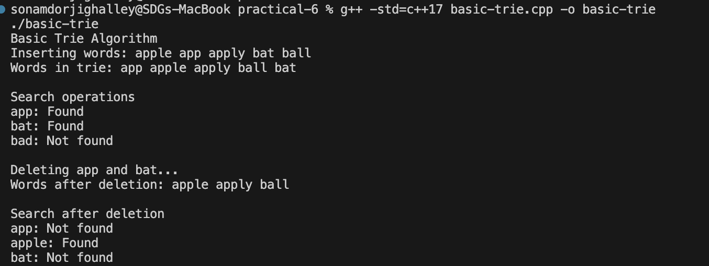
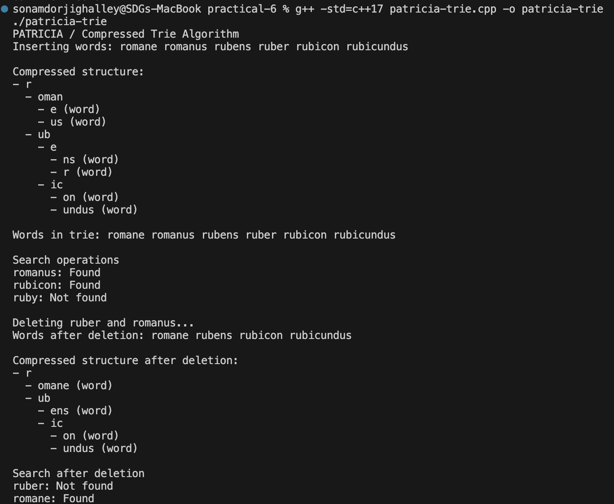
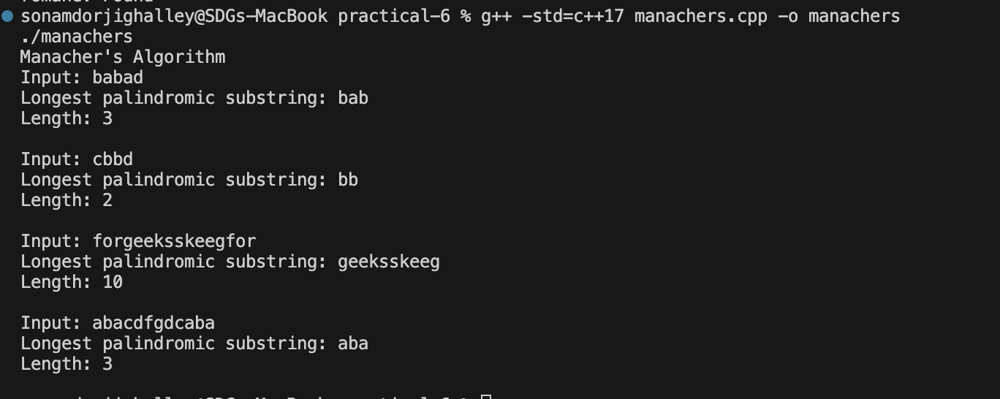

# Practical-6: Trie, PATRICIA Trie, and Manacher's Algorithm

## Overview

This practical implements three string-processing algorithms in C++:

- **Basic Trie** with insert, search, and deletion operations
- **PATRICIA / compressed trie** with insert, search, and deletion operations
- **Manacher's Algorithm** for finding the longest palindromic substring in linear time

---

## 1. Basic Trie Algorithm

### File: `basic-trie.cpp`

### Algorithm Explanation

A trie stores strings character by character in a tree. Each path from the root can represent a word, and a boolean marker is used to show where a complete word ends.

**Operations implemented:**

1. **Insert**
   - Start from the root
   - Create missing child nodes for each character
   - Mark the last node as the end of a word

2. **Search**
   - Traverse each character from the root
   - If any required child is missing, the word is not present
   - Return true only if the final node is marked as a word ending

3. **Deletion**
   - Recursively unmark the final node
   - Remove unused nodes while backtracking
   - Preserve nodes that are still needed by other words

### Time Complexity

| Operation | Complexity |
| --------- | ---------- |
| Insert    | O(L)       |
| Search    | O(L)       |
| Delete    | O(L)       |

Where `L` is the length of the word.

### Space Complexity

O(N × L), where `N` is the number of words and `L` is the average word length.

### Output



---

## 2. PATRICIA Algorithm

### File: `patricia-trie.cpp`

### Algorithm Explanation

PATRICIA, also called a compressed trie or radix tree, reduces chains of single-child trie nodes into one labelled edge. This saves memory and makes the structure more compact.

**Operations implemented:**

1. **Insert**
   - Find the edge that starts with the first character
   - Compare the new word with the edge label
   - Split the edge when the common prefix ends
   - Add the remaining suffix as a new compressed edge

2. **Search**
   - Match complete edge labels instead of single characters
   - Continue until the whole word is consumed
   - Return true only if the final node marks a complete word

3. **Deletion**
   - Unmark the word ending
   - Delete empty nodes
   - Merge a non-terminal node with its only child to keep the trie compressed

### Time Complexity

| Operation | Complexity |
| --------- | ---------- |
| Insert    | O(L)       |
| Search    | O(L)       |
| Delete    | O(L)       |

Where `L` is the length of the word being processed.

### Space Complexity

Usually less than a basic trie because repeated single-child paths are compressed into longer edge labels.

### Output



---

## 3. Manacher's Algorithm

### File: `manachers.cpp`

### Algorithm Explanation

Manacher's Algorithm finds the longest palindromic substring in O(N) time. It transforms the string by inserting separators so odd-length and even-length palindromes can be handled in one pass.

**Key steps:**

1. Transform the input string using separators, for example `abba` becomes `@#a#b#b#a#$`
2. Maintain the current palindrome center and right boundary
3. Use the mirror position to avoid repeating comparisons
4. Expand around the current center only when needed
5. Track the center with the largest palindrome radius

### Time Complexity

O(N), where `N` is the length of the input string.

### Space Complexity

O(N) for the transformed string and radius array.

### Output



---

## Reflection

Implementing the basic trie helped show how prefix sharing works in a direct and readable way. Insert and search were straightforward because every character maps to one level of the tree. Deletion required more care because removing a word should not break another word that shares the same prefix. For example, deleting `app` must not delete `apple` or `apply`.

The PATRICIA trie was more challenging because each edge stores a string segment instead of one character. The main difficulty was handling edge splitting during insertion and merging after deletion. This made the implementation more complex than the basic trie, but it also showed why compressed tries are useful: they reduce unnecessary nodes when many paths have only one child.

Manacher's Algorithm was different from the trie-based tasks because it focuses on efficient string scanning rather than tree operations. The transformed string made odd and even palindromes behave uniformly. The most important idea was reusing information from the mirror index so the algorithm does not repeatedly expand the same palindrome regions.

Overall, this practical strengthened my understanding of string data structures and string pattern analysis. The basic trie is easiest to understand, the PATRICIA trie is more memory efficient, and Manacher's Algorithm is highly efficient for palindrome detection.

---

## Compilation Commands

```bash
g++ -std=c++17 basic-trie.cpp -o basic-trie
./basic-trie

g++ -std=c++17 patricia-trie.cpp -o patricia-trie
./patricia-trie

g++ -std=c++17 manachers.cpp -o manachers
./manachers
```
